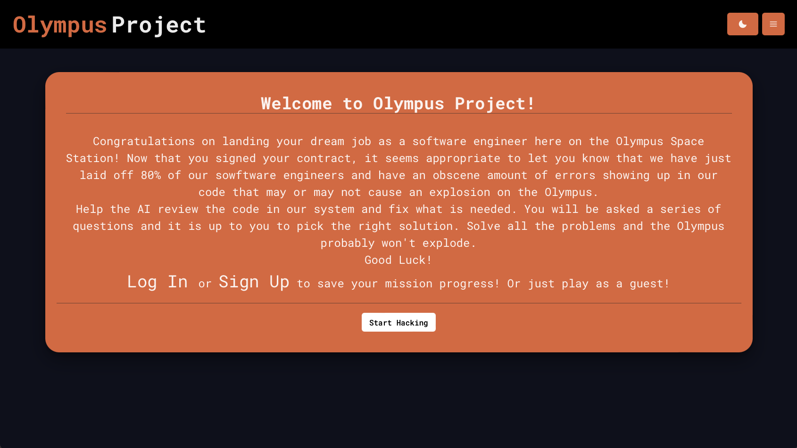

# The Olympus Project 

## Table of Content
  * [Description](#description)
  * [Usage](#usage)
  * [Issue](#issue)
  * [Contribution](#contribution)
  * [Test](#test)
  * [User Story](#user-story)
  * [Installation](#installation)
  * [Technology Used](#technology-used)
  * [Questions](#questions)
  * [Credits](#credits)
  * [License](#license)

## Description 
The Olympus Project is a review game to help student remember the different methods there are in Java Script. The user is stuck in space due to the rocket getting hack. They most use their coding knowledge to answer questions that will undo the hackers work. When they are able to get all the questions correct then they blastoff to go back home.

## Usage
To use the application go to the website and click start hacking. From there click on the image and answer the questions as they pop up. Visit
deployed applicatio here: https://olympus-prjct.herokuapp.com

## Issue
If there is an issue go https://github.com/trufl/Olympus-Project and create an issue.

## Contribution
To contribute to the project please contact the developers through https://github.com/trufl/Olympus-Project. 

## Test
To test the application a person can download the code and run it on localhost:3000.

## User Story
When a user goes to the homepage of the game, then the user  has an option to sign in or play as a guest.
When a user logs in, then the users progress is saved as they progress through the game.
When the user starts the game, then the user is presented with a spaceship and must solve the puzzles to get the spaceship working.
When a user solves all the puzzles, then the space ship is able to continue to its destination of Earth.

## Installation
N/A

## Technology Used
In this project we used Stripe, MongoDB, React, GraphQL, Apollo Server, Chakra UI and Bcrypt.

## Questions
If you have any questions, how to contribute or additional feedback, please contact our GitHub Repository and we will get back to you as soon as possible.

Contact Info: 
GitHub: The github accounts of the creators are https://github.com/hoeferg, https://github.com/derricklaff, and https://github.com/trufl]
  
## Credits
The three creator's are Gayle Hoefer, Tristan Saragosa, and Derrick Lafforthun.

